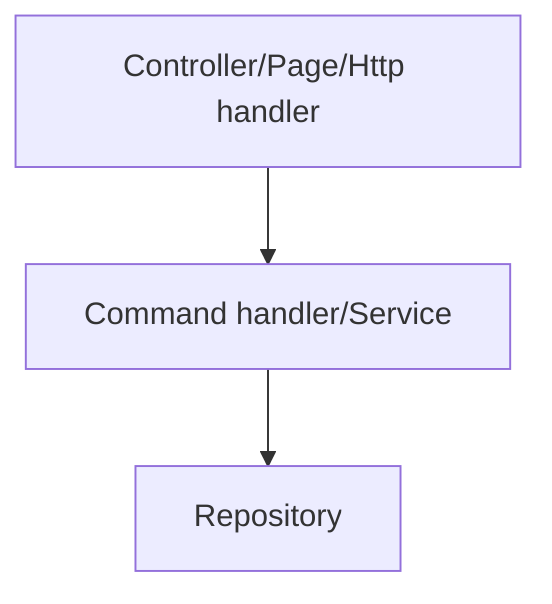
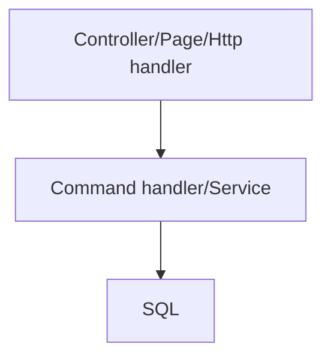
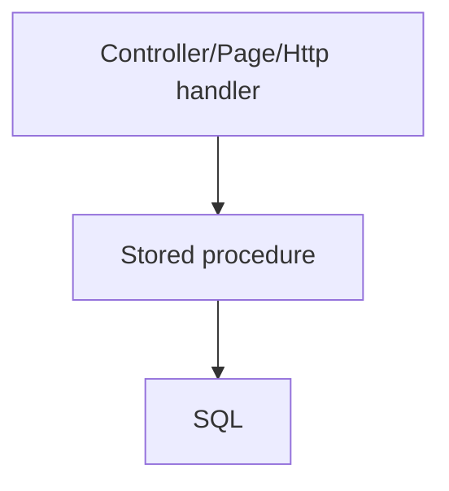
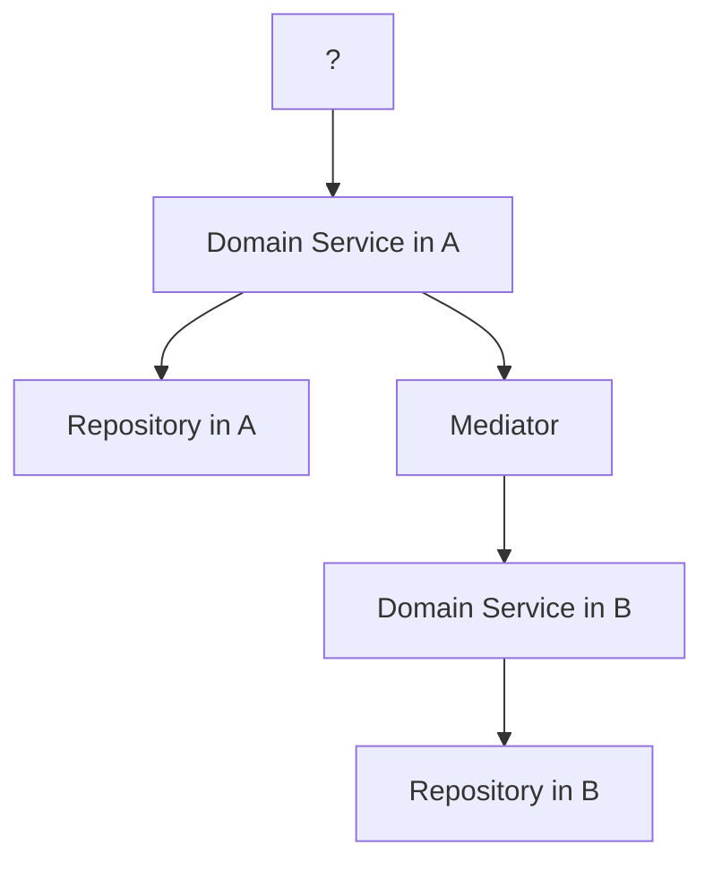
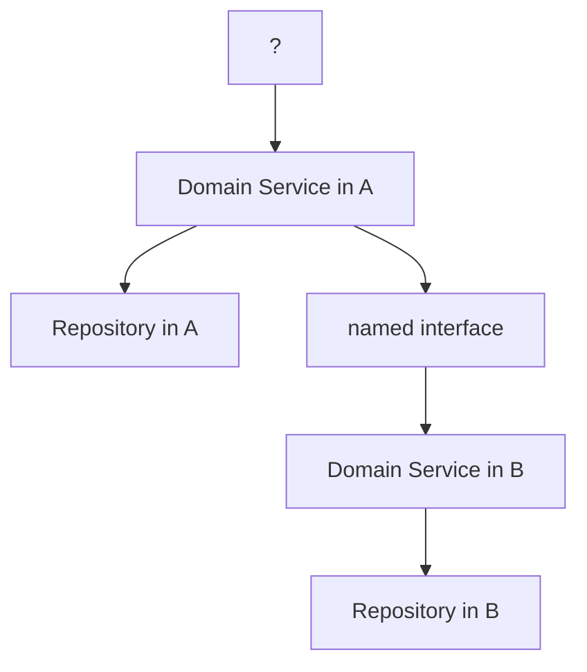

## Command handlers are services

If we start from the [command redux post by Ayende](https://ayende.com/blog/159969/design-patterns-in-the-test-of-time-command-redux). In actual shopping scenarios we need to deal with not a clear script of actions that can be executed in a sequential manner. Instead we have a unidirectional wizard-style flow where the customer is redirected from the shopping site to payment provider and back. Let us ignore these complexities and look at the following:

``` C#
  var placeOrderCommand = new CompositeCommand(
    new RegisterOrderCommand(),
    new ReserveStockCommand(),
    new ChargeCardCommand(),
    new ShipOrderCommand()
  )
  {
    Sequential = true,
    StopOnError = true
  };
```

we note that the limitations around using simple compositions of [commands](https://ayende.com/blog/159873/design-patterns-in-the-test-of-time-command). The beauty of the command pattern is more obvious when the entire user action can be encapsulated into a class such as a service class in DDD [could also](http://gorodinski.com/blog/2012/04/14/services-in-domain-driven-design-ddd/) be called a command handler.

``` C#
  public class PlaceOrderService
  {
    private readonly BusinessDbContext _dbcontext;
    ...
    private readonly ProductSettings _productSettings;
    public PlaceOrderService(
      BusinessDbContext dbcontext,
      ...
      IOption<ProductSettings> productSettings)
    {
      _dbcontext = dbcontext;
      ...
      _productSettings = productSettings.Value ?? throw new ArgumentNullException(nameof(productSettings));
    }

    public Task Execute(PlaceOrderCommand command)
    {
      // register order in DB
      _dbContext.RegisteredOrders.Add(new RegisteredOrder{ ... });
      ...

      await _dbcontext.SaveChangesAsync();
      ...
    }
  }
```

Reference:

- [IOptions](https://docs.microsoft.com/en-us/dotnet/api/microsoft.extensions.options.ioptions-1?view=dotnet-plat-ext-3.1)
- [DbContext](https://docs.microsoft.com/en-us/ef/core/index)

Since dbcontext in asp.net core Entity Framework implements [unit of work](https://www.martinfowler.com/eaaCatalog/unitOfWork.html) the command handler uses only one unit of work context. If you use a sql connection you could instead replicate this behavior with a transaction.


You can then compose your code as following:



Read more about command handler in the [following README](https://github.com/wallymathieu/entity-framework-studies/tree/2583db455d37ff93230b1a181379ca09ac71b101/src/Web/Commands).

## Separation of database and domain logic

Even though it is [good design to keep your domain logic ignorant of persistence](https://docs.microsoft.com/en-us/dotnet/architecture/microservices/microservice-ddd-cqrs-patterns/ddd-oriented-microservice), dependency on ORM or a specific database concepts can create an implicit dependency on the persistence technology that you choose. In many simple scenarios it doesn't make sense to isolate persistence completely from the domain model. In Ruby on Rails the choice is to spin up a [sqlite database for small application tests](https://dhh.dk/2014/test-induced-design-damage.html). The same can be done with many modern ORM.

An alternative approach is to have a database with the same schema available for testing and then either letting the database become "dirty" or put the entire test under a transaction that is rolled back so that the database is kept clean between tests.

An alternative view is to avoid using an ORM and instead using a simpler mapper in order to put more of the [domain logic in the database](https://rob.conery.io/2015/02/23/embracing-sql-in-postgres/).



You could even skip a layer and let the controller talk SQL directly if the service abstraction is not needed. You can still design your database such that stored procedures match what would otherwise be command handlers.



The downside is that such a scheme complicates unit testing. If you have simple domain logic that seldom change, you might less need for an extensive test suite.

## Separation of bounded contexts

If you want to go further along the line of modular monolith or microservices you want to decompose parts such that:



In the modular monolith scenario A and B are seen as separate parts but are deployed at the same time.

There is a cost/benefit of introducing loose coupling. Why a nicer approach could be to:



The cost of having a mediator pattern is that it makes it harder to follow the system logic.

## Conclusion

Domain services map well to command handlers. Embracing SQL can be a fruitful approach. You need to evaluate the need for separation or abstraction as you go.
